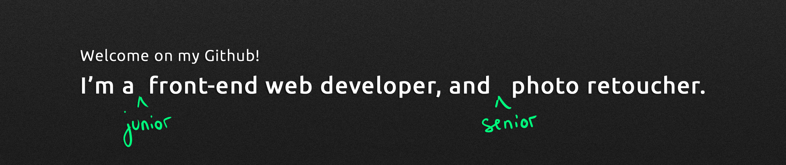

# 
## Welcome 👋 !  
###  My name is Nicolas I'm a photographer / retoucher making websites.  

## Where to find me 🌴
👉 [LinkedIn](http://www.linkedin.com/nicolashodee)  
👉 [Instagram](http://www.instagram.com/nicolas_hodee_photography)  
👉 [Website - Personnal portfolio](http://www.nicolashodee.com)  

## What I use 🤘  :

     
    Adobe Photoshop 
    Final Cut Pro 
    Html / CSS / Javascript
    Heroku
    Wordpress
    GSAP
    Git
    Foundation
    MySql
    Php
    NPM 
    Parcel
    Ruby on Rails (sometimes)
## What else.. ?
- 🔭 I’m currently working on -> Wordpress custom websites
- 🌱 I’m currently learning -> CSS / Javascript / PHP
- 👯 I’m looking to collaborate on -> small websites for locals shops and small companies
- 🤔 I’m looking for help with -> PHP / Custom Wordpress sites
- 💬 Ask me about -> Photography, I'm a killer !
- 📫 How to reach me: contact(at)nicolashodee.com
- ⚡ Fun fact: Do you know the difference between a french developper and a baguette ? 

<!--
**nicolashodee/nicolashodee** is a ✨ _special_ ✨ repository because its `README.md` (this file) appears on your GitHub profile.

Here are some ideas to get you started:

-->
